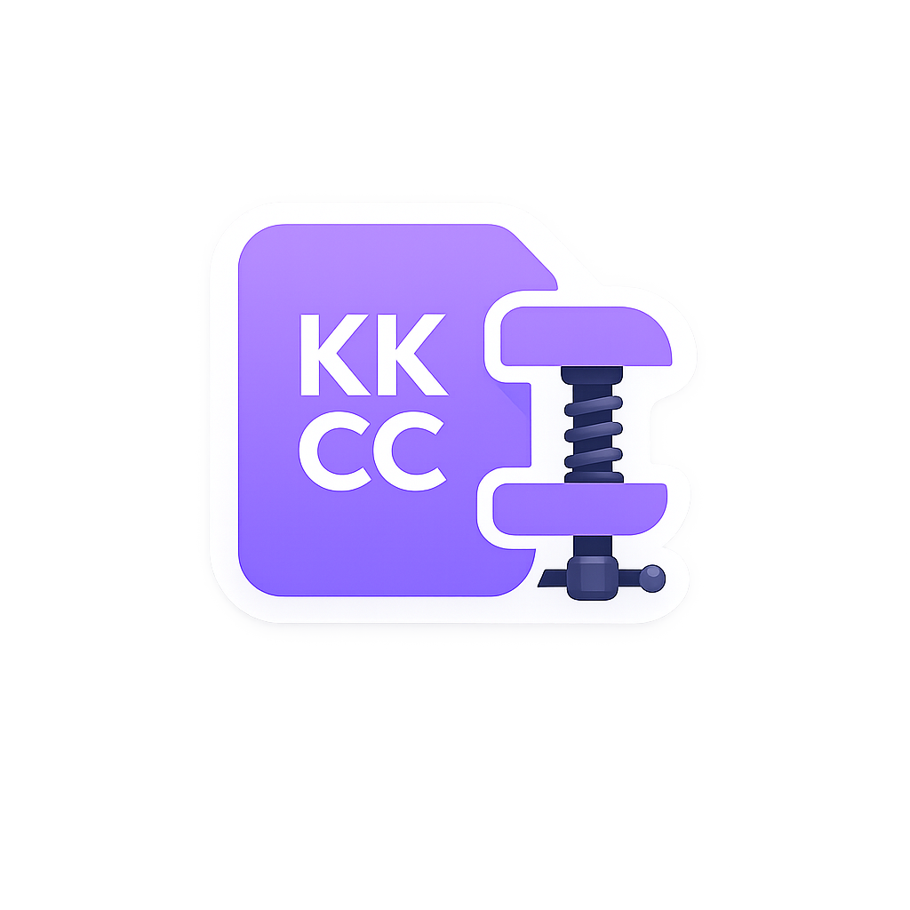

# KK Card Compression

<p align="center">
  
</p>

Koikatsu / Koikatsu Party のカード・シーン PNG ファイルを LZMA でロスレス圧縮／解凍するツール群。

## 概要

| コンポーネント | 形式 | 用途 |
|----------------|------|------|
| **KK_CardCompression.dll** | BepInEx プラグイン | ゲーム内でセーブ時に自動圧縮、ロード時に自動解凍 |
| **KKCC.exe** | WPF デスクトップアプリ | ファイルをドラッグ＆ドロップでバッチ圧縮／解凍 |

**圧縮形式**: PNG の tEXt チャンク（`[KK]` マーカー）内のゲームデータを LZMA 圧縮。元の PNG 画像部分はそのまま保持するため、エクスプローラのサムネイル表示には影響しない。

| マーカー | 状態 |
|----------|------|
| `100` | 未圧縮（バニラ） |
| `101` | LZMA 圧縮（本ツール / KK_SaveLoadCompression 互換） |

- キャラカードで約 **60-70%** 削減（例: 6 MB → 2 MB）
- シーンファイルで約 **40-50%** 削減
- バイト単位で完全復元（ロスレス）

## 構成

```
KK_CardCompression/
├── src/
│   ├── Plugin/                    # BepInEx プラグイン (.NET Framework 4.8)
│   │   ├── KK_CardCompression.csproj
│   │   ├── Plugin.cs              # エントリポイント
│   │   ├── PngCompression/        # PNG LZMA 圧縮エンジン
│   │   ├── Extension/             # 共通ユーティリティ
│   │   ├── Extension.Unity/       # [削除済] Unity 依存コード（旧ウォーターマーク機能）
│   │   ├── Resources/             # 埋め込みリソース
│   │   └── Embedded/              # 埋め込み SevenZip.dll（ビルド時に自動生成）
│   ├── App/                       # デスクトップアプリ (.NET 8 WPF)
│   │   ├── KK_CardCompression.csproj
│   │   ├── MainWindow.xaml(.cs)   # メイン UI
│   │   ├── Models/                # データモデル
│   │   └── Services/              # 圧縮・設定サービス
│   └── TestRunner/                # テストプロジェクト
├── Assets/                        # アプリアイコン
├── tools/                         # Python ユーティリティ
├── .github/workflows/             # CI / CD
└── KK_CardCompression.sln         # Visual Studio ソリューション
```

## 動作環境

### プラグイン (DLL)
- **Koikatsu** (Koikatu) または **Koikatsu Party**
- **BepInEx 5.4.x**（BepInEx.Core 5.4.21 との依存あり）
- **KK_SaveLoadCompression.dll** の同梱は不要（単一ファイルで動作）

### デスクトップアプリ (EXE)
- **.NET 8 Desktop Runtime** (x64)
  - [ダウンロード](https://dotnet.microsoft.com/download/dotnet/8.0)
- Windows 10 以降

## ビルド

### 前提
- [.NET 8 SDK](https://dotnet.microsoft.com/download/dotnet/8.0)
- Visual Studio 2022 または `dotnet` CLI

### プラグイン
```bash
dotnet build src/Plugin/KK_CardCompression.csproj -c Release
# 出力: src/Plugin/bin/Release/KK_CardCompression.dll
```

### デスクトップアプリ
```bash
dotnet build src/App/KK_CardCompression.csproj -c Release
# 出力: src/App/bin/Release/net8.0-windows/win-x64/
```

```bash
# 単一ファイル発行
dotnet publish src/App/KK_CardCompression.csproj -c Release -o publish/
```

### 両方一括
```bash
dotnet build KK_CardCompression.sln -c Release
```

## インストール

### プラグイン
1. `KK_CardCompression.dll` を以下のいずれかに配置:
   - `BepInEx\plugins\KK_CardCompression\KK_CardCompression.dll`（推奨）
   - `BepInEx\plugins\raurau\KK_CardCompression.dll`（旧配置）
2. **必須**: `BepInEx\plugins\raurau\SevenZip.dll` が残っている場合は削除（v1.0.0 以降は単一 DLL で動作）
3. **必須**: 旧 `jim60105\KK_SaveLoadCompression.dll` が存在する場合は削除（競合防止）
4. Koikatsu 起動後、F1 → Plugin Settings → **KK Card Compression** → Enable = ON

### 設定（F1 メニュー）

| セクション | キー | デフォルト | 説明 |
|-----------|------|-----------|------|
| Config | Enable | true | プラグイン全体の有効／無効 |
| Settings | Delete the original file | true | 圧縮後に元ファイルを上書き |
| Settings | Display compression message on screen | true | 画面に圧縮メッセージ表示 |
| Settings | Skip bytes compare when saving | false | 保存時のバイト検証をスキップ |
| Enable at Where | Character | true | キャラ保存時に圧縮 |
| Enable at Where | Coordinate | true | コーデ保存時に圧縮 |
| Enable at Where | Studio Scene | true | スタジオシーン保存時に圧縮 |

### デスクトップアプリ
1. `KKCC.exe` を任意の場所に配置
2. .NET 8 Desktop Runtime をインストール
3. アプリ起動後、PNG ファイル／フォルダをドラッグ＆ドロップ
4. 「圧縮」または「解凍」をクリック
5. 必要に応じて「低CPU優先度」トグルをON（圧縮中のCPU負荷を抑制）

## 相互運用性

- **互換性あり**: KK_SaveLoadCompression.dll (jim60105 版) — 同一の LZMA マーカー形式（101）を使用
- **互換性なし**: Zstd 圧縮形式（102, 103） — 本ツールは LZMA のみ対応

## ライセンス

Apache-2.0

## 作者

raurau
