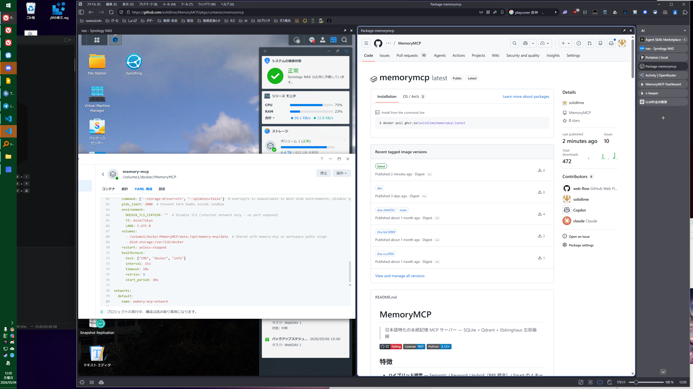

# KK Archive

Koikatsu のカード/シーン PNG を圧縮・解凍するデスクトップツールです。

## スクリーンショット



## 互換性

圧縮レベルは以下の 3 種類を選べますが、すべて互換性を維持します。

- ⚡ 速い (互換)
- ⚖ 標準
- ◆ 最大圧縮

互換性を維持できる理由:
- LZMA DictionarySize は常に 64 MiB 固定
- LZMA プロパティはストリーム先頭に埋め込まれ、デコーダが自動で復元

## 主な機能

- 入力/出力の 2 ペイン一覧
- 出力サイズ列に個別進捗バーを表示（列幅に追従）
- ステータス部に全体進捗バーを表示
- ファイル/フォルダのドラッグ & ドロップ
- 出力ファイルのダブルクリックで開く
- 出力ファイルを Explorer にドラッグ可能
- 入力一覧で Delete キー削除（実ファイルは削除しない）
- 出力先フォルダを exe ルートの ini に保存し、次回起動時に復元
- 圧縮率は処理完了後のみ表示（処理中は `—`）
- 圧縮レベルはクリックでドロップダウン選択可能

## 設定保存

実行ファイルと同じフォルダに `KK_Archive.ini` を作成します。

保存項目:
- LastOutputDirectory
- CompressionLevel

## 圧縮率表示

- 圧縮できた場合: `xx.x%削減`
- サイズが増えた場合: `xx.x%増加`

## ビルド

```bash
dotnet build -c Release
```

## 実行

```bash
dotnet run
```

## ブランチ運用（main を既定、master を削除）

このリポジトリの運用を `main` に統一する場合は、次の順で実施します。

1. GitHub の Settings > Branches で default branch を `main` に変更
2. ローカルで最新化

```bash
git fetch origin --prune
```

3. リモート `master` を削除

```bash
git push origin --delete master
```

4. 確認

```bash
git branch -r
```

`origin/master` が表示されなければ完了です。
